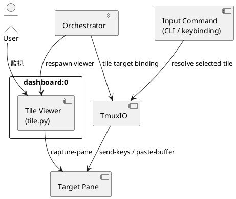
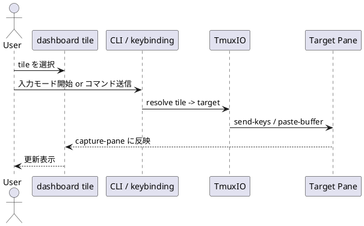

# dashboard-input-proxy dashboard 選択ペイン入力プロキシ分析 — 設計（HOW）

## 目的・制約（要件から転記・圧縮） (必須)
- 目的: dashboard の read-only 監視体験を維持しつつ、選択 tile に対応する元ペインへだけ入力可能にする実現方式を設計レベルで提案する
- MUST:
  - 現状アーキテクチャの事実と責務境界を明示する
  - 実現案を比較し、最終推奨を 1 つ選ぶ
  - 将来実装時の変更責務と段階導入案を示す
- MUST NOT:
  - attach / switch-client を主方式として推奨しない
  - tile viewer をそのまま実ペインと誤認する設計にしない
- 非交渉制約:
  - dashboard 既定は read-only
  - 選択 tile 以外へ入力を送らない
  - global tmux 設定汚染を避ける
- 前提:
  - 各 tile は `respawn-pane` された viewer process
  - target pane は別 session / window / pane に存在する

---

## 既存実装/規約の調査結果（As-Is / 95%理解） (必須)
- 参照した規約/実装（根拠）:
  - `AGENTS.md`: spec-lite を正本にし、設計・計画・報告を分けるため
  - `README.md`: 「live view of another tmux session, continuously updated using capture-pane」と明記されているため
  - `tmux_dashboard/orchestrator.py`: `run_once()` が `tile.py` を `respawn-pane` して tile viewer を構成しているため
  - `tmux_dashboard/tile.py`: capture-only loop の具体挙動を決めているため
  - `tmux_dashboard/tmuxio.py`: driver 抽象に何があり、何が足りないかを把握するため
  - `tmux-dashboard`: wrapper が attach / switch-client を含み、既知の不安定面と密接に関わるため
  - `tests/test_wrapper_runtime.py`: attach 以前の bootstrap failure をどう扱っているか確認するため
  - `spec-lite/completed/20260401_081936_main/report.md`: attach / multi-client / window-size の既知障害履歴を確認するため
- 観測した現状（事実）:
  - `run_once()` は `resolver(sess)` で `target pane` を決め、`respawn-pane` で tile viewer を起動する
  - tile は `capture-pane` をポーリングし、画面クリアして再描画するだけで stdin を扱わない
  - mapping は `_last_mapping` にのみ保持され、tmux 上の永続メタデータには書かれていない
  - `TmuxIO` には `send_keys`, `set_pane_option`, `get_pane_option`, `active_pane_in_window` 相当の公開契約がない
  - wrapper は `window-size latest` を維持しつつ runner window を起動するが、attach 系は別問題として扱われている
- 採用するパターン（命名/責務/例外/DI/テストなど）:
  - 制御面は `Orchestrator` / `TmuxIO` に置き、tile renderer には極力責務を足しすぎない
  - 既存 driver abstraction を拡張し、CLI / libtmux 両方で同じ契約を持たせる
  - fail-closed。target 解決不能時は送信しない
  - テストは unit / orchestrator / cli_entry を先に固め、必要最小限の E2E に絞る
- 採用しない/変更しない（理由）:
  - attach / switch-client 主方式: 既知障害と再結合し、dashboard の安定参照面を壊しやすい
  - control-mode broker 先行導入: 今回の要件に対して過剰
  - tile を「実ペイン埋め込み」に見せる再設計: 現行 viewer 前提と矛盾
- 影響範囲（呼び出し元/関連コンポーネント）:
  - `tmux_dashboard/orchestrator.py`
  - `tmux_dashboard/tmuxio.py`
  - `tmux_dashboard/tile.py`
  - `tmux_dashboard/__main__.py`
  - `README.md`
  - `tests/test_tmuxio.py`, `tests/test_orchestrator.py`, `tests/test_cli_entry.py`, 必要なら最小 E2E

## 主要フロー（テキスト：AC単位で短く） (任意)
- Flow for AC-001:
  1) `run_once()` が session 一覧から tile レイアウトを計算する
  2) `resolver(sess)` が target pane を決める
  3) `respawn-pane` で tile viewer が起動し、`capture-pane` を描画する
- Flow for AC-002:
  1) tile と target pane の対応を pane option などの正本へ保存する
  2) 入力コマンドが「選択 tile」を解決する
  3) `send-keys` / `paste-buffer` で target pane へだけ入力を送る
- Flow for AC-003:
  1) MVP は command injection か armed mode のどちらかで開始する
  2) stale mapping と複数 client の edge case を fail-closed に扱う
  3) 段階的に特殊キー・paste・描画改善へ拡張する

## データ・バリデーション（必要最小限） (任意)
- MODEL-001: TileTargetBinding
  - Fields:
    - `tile_pane_id`
    - `target_pane_id`
    - `session_name`
    - `binding_version` または `layout_signature`
  - Constraints/Validation:
    - `tile_pane_id` と `target_pane_id` は tmux 上で存在確認可能であること
    - 再レイアウト時は古い binding を上書きまたは削除すること
- MODEL-002: InputMode
  - Fields:
    - `mode` = `view` | `input-armed`
    - `armed_at` (任意)
  - Constraints/Validation:
    - 非 armed 状態では一切送信しない

## 判断材料/トレードオフ（Decision / Trade-offs） (任意)
- 論点: どの方式を主提案にするか
  - 選択肢A: tile に入力プロキシモードを追加し、`send-keys` / `paste-buffer` で転送
    - Pros: 現行 viewer 構造に最も整合、attach 不安定を避けられる、選択タイルのみ操作しやすい
    - Cons: 完全 TUI 互換は難しい、raw input と特殊キー整理が必要
  - 選択肢B: dashboard 側の command-prompt / CLI から 1 行コマンド送信
    - Pros: 安全、軽量、初期導入が容易
    - Cons: 対話操作には弱い
  - 選択肢C: control-mode broker
    - Pros: 将来拡張性が高い
    - Cons: 大きすぎる
  - 選択肢D: attach / switch-client
    - Pros: fidelity は高い
    - Cons: 既知リスクと衝突
  - 決定: 主提案は A、実装フェーズの入口としては B を先に採る段階導入を推奨
  - 理由: 現行設計との整合と実施可能性のバランスが最も良い

## インターフェース契約（ここで固定） (任意)
### 関数・クラス境界（重要なものだけ）
- IF-001: `TmuxIO.send_keys(target_pane: str, keys: list[str], *, literal: bool = False) -> None`
  - Input: target pane id、送信キー列
  - Output: なし
  - Errors/Exceptions: target 解決不能時は例外または fail-closed 戻り
- IF-002: `TmuxIO.set_pane_user_option(tile_pane: str, option_name: str, value: str) -> None`
  - Input: tile pane id、pane option 名、値
  - Output: なし
  - Errors/Exceptions: tmux option 設定失敗
- IF-003: `TmuxIO.get_pane_user_option(tile_pane: str, option_name: str) -> str | None`
  - Input: tile pane id、pane option 名
  - Output: 値または未設定
  - Errors/Exceptions: fail-closed
- IF-004: `Orchestrator.persist_tile_bindings(window_target: str, mapping: list[tuple[str, str, str]]) -> None`
  - Input: tile-target mapping
  - Output: なし
  - Errors/Exceptions: 書き込み失敗時は入力機能を無効化してログ
- IF-005: `__main__` 単発送信コマンド
  - Input: `--tile-pane` または `--selected`, `--send-text`, `--enter`, `--paste`
  - Output: exit code / log
  - Errors/Exceptions: binding 不在、target 不在、曖昧 selected は non-zero or explicit error

## 変更計画（ファイルパス単位） (必須)
- 追加（Add）:
  - `spec-lite/current/discussions/dashboard-input-proxy-analysis.md`: 比較表と PlantUML を含む提案資料
- 変更（Modify）:
  - `spec-lite/current/requirement.md`: 分析要件を記述
  - `spec-lite/current/design.md`: 候補方式と推奨設計を固定
  - `spec-lite/current/plan.md`: 将来実装の段階導入計画を記述
  - `spec-lite/current/report.md`: 調査ログと結論を記録
- 削除（Delete）:
  - 該当なし
- 移動/リネーム（Move/Rename）:
  - 該当なし
- 参照（Read only / context）:
  - `tmux_dashboard/orchestrator.py`: mapping と renderer 起動の責務確認
  - `tmux_dashboard/tmuxio.py`: driver API の現状確認
  - `tmux_dashboard/tile.py`: capture-only loop の確認
  - `tmux-dashboard`: wrapper / attach の責務確認
  - `README.md`: 既存 product explanation の確認
  - `tests/test_wrapper_runtime.py`: attach 周辺の既知障害確認

## マッピング（要件 → 設計） (必須)
- AC-001 → 既存実装/規約の調査結果, Flow for AC-001, discussion シート
- AC-002 → Decision / Trade-offs, IF-001〜IF-005, discussion シート比較表
- AC-003 → 変更計画, テスト戦略, `plan.md`
- EC-001 → IF-003, selected 解決方針, fail-closed
- EC-002 → MVP 入力範囲の限定, 段階導入
- 非交渉制約 → A/B/C/D 比較で attach 主方式を外し、control-plane を採用

## テスト戦略（最低限ここまで具体化） (任意)
- 追加/更新するテスト:
  - Unit:
    - `tests/test_tmuxio.py`: `send_keys`, pane option get/set, selected pane 解決
    - `tests/test_orchestrator.py`: tile-target binding 永続化 / cleanup
    - `tests/test_cli_entry.py`: 単発送信コマンドの正常系 / 異常系
  - Integration:
    - 必要最小限の tmux E2E で「tile -> target へのコマンド送信」を検証
- どのAC/ECをどのテストで保証するか:
  - AC-003 → `tests/test_tmuxio.py`, `tests/test_orchestrator.py`, `tests/test_cli_entry.py`
  - EC-001 → `tests/test_cli_entry.py` の ambiguous selection / option missing
  - EC-002 → 仕様書・README・MVP 範囲記述 + 追加 E2E 限定
- 非交渉制約（requirement.md）をどう検証するか:
  - 制約: dashboard 既定は read-only
    - 検証方法: armed mode / input command 未使用時に送信 API が呼ばれないことを unit test で保証
  - 制約: attach 主方式へ戻さない
    - 検証方法: 実装案に wrapper / switch-client を含めないことを設計レビューで確認
- 実行コマンド（該当するものを記載）:
  - `uv run pytest`
- 変更後の運用（必要なら）:
  - 移行手順: Phase 1 では CLI 送信コマンドのみ有効化
  - ロールバック: 入力系 CLI を外して viewer-only に戻す
  - Feature flag: `viewer.input_proxy_enabled` のような明示フラグを検討

## リスク/懸念（Risks） (任意)
- R-001: tile-target binding が stale になる
- R-002: 特殊キーや IME の扱いが複雑
- R-003: 複数 client で selected 解決がぶれる
- R-004: TUI アプリで期待と異なる描画 / 入力体験になる

## 未確定事項（TBD） (必須)
- Q-001:
  - 質問: Phase 1 を B 案（1 行送信）から始めるか、A 案（armed mode）から始めるか
  - 選択肢:
    - A: B 案から始めて routing を固める
    - B: 最初から A 案へ入り、viewer 内入力を実現する
  - 推奨案（暫定）: A
  - 影響範囲: plan / テスト / UX
- Q-002:
  - 質問: tile-target binding を pane user option に置くか、別状態管理に置くか
  - 選択肢:
    - A: pane user option (`@tmux_dashboard_target_pane`)
    - B: 外部 state file / process memory
  - 推奨案（暫定）: A
  - 影響範囲: IF-002 / IF-003 / stale cleanup

---

## ディレクトリ/ファイル構成図（変更点の見取り図） (任意)
```text
/srv/mount/tmux-dashboard/
├── spec-lite/
│   └── current/
│       ├── requirement.md                         # Modify
│       ├── design.md                              # Modify
│       ├── plan.md                                # Modify
│       ├── report.md                              # Modify
│       └── discussions/
│           └── dashboard-input-proxy-analysis.md  # Add
```

## UML図（PlantUML） (任意)
### コンポーネント図（境界/責務/依存の俯瞰）


### シーケンス図（時系列・IFのやり取り）


## 省略/例外メモ (必須)
- この設計書は分析タスクのため、実装 IF は提案レベルで固定している
