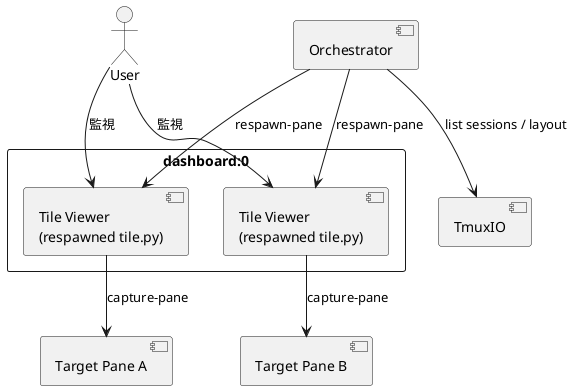
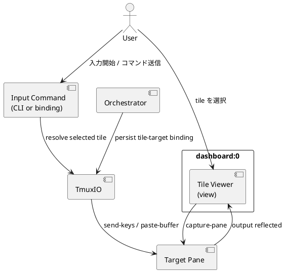

# dashboard input proxy analysis

## 目的
- `tmux-dashboard` の dashboard を read-only のまま維持しつつ、選択した tile に対応する元ペインへだけ入力できる技術方式を比較し、実施可能な best practice を提案する。

## エグゼクティブサマリー
- 現状の各 tile は「元ペインそのもの」ではなく、`capture-pane` を描き直す viewer です。
- したがって、今入力できないのは不具合というより現行設計どおりです。
- 過去の attach / switch-client 問題を踏まえると、dashboard から直接 attach して実ペインを触る方式は主方式にすべきではありません。
- 最適解は、viewer 構造を維持したまま、選択 tile だけを明示的に armed にして、`send-keys` / `paste-buffer` で元ペインへ入力を転送する control-plane 方式です。
- 導入順としては、まず「選択 tile へ 1 行コマンド送信」を先に入れ、その後に armed input mode へ拡張するのが安全です。

## 現状理解

### 現在の実装が read-only である理由
- `Orchestrator.run_once()` は tile ごとに `tmux_dashboard.tile` を `respawn-pane` している。
- `tile.py` は `capture-pane` をポーリングし、ANSI を保ったまま viewer として描画している。
- tile 側には stdin 処理も入力転送 API もない。
- `TmuxIO` に `send-keys` や pane user option の契約が存在しない。
- README も product を「live view」と説明しており、interactive terminal とは説明していない。

### 根拠ファイル
- [orchestrator.py](/srv/mount/tmux-dashboard/tmux_dashboard/orchestrator.py#L328)
- [orchestrator.py](/srv/mount/tmux-dashboard/tmux_dashboard/orchestrator.py#L493)
- [tmuxio.py](/srv/mount/tmux-dashboard/tmux_dashboard/tmuxio.py#L281)
- [tmuxio.py](/srv/mount/tmux-dashboard/tmux_dashboard/tmuxio.py#L355)
- [tile.py](/srv/mount/tmux-dashboard/tmux_dashboard/tile.py#L1)
- [tile.py](/srv/mount/tmux-dashboard/tmux_dashboard/tile.py#L67)
- [README.md](/srv/mount/tmux-dashboard/README.md#L41)
- [tmux-dashboard](/srv/mount/tmux-dashboard/tmux-dashboard#L217)

## 構造図

### 現状アーキテクチャ

### 推奨アーキテクチャ

## 技術候補

### 案A: armed input proxy mode
- 概要:
  - viewer を維持しつつ、選択 tile だけを `input-armed` にする
  - armed 中だけ tile か別コマンドが target pane へ入力を forward する
  - 入力は `send-keys` を主、長文は `paste-buffer` を使う
- 向いている用途:
  - shell コマンド投入
  - basic key 操作
  - attach を避けたい運用

### 案B: command injection only
- 概要:
  - tile は完全に read-only のまま
  - dashboard 側の command-prompt や CLI から、選択 tile の target pane に 1 行コマンドを送る
- 向いている用途:
  - まず最小リスクで操作導線を試したい場合

### 案C: control-mode broker
- 概要:
  - 専用 broker が tmux control mode client として接続し、入力・状態同期・イベント配信を管理する
- 向いている用途:
  - 将来的に大規模な interactive feature を広げたい場合

### 案D: attach / switch-client
- 概要:
  - 選択 tile から元 session / pane へ切り替えて直接操作する
- 向いている用途:
  - 完全 fidelity を最優先するとき
- ただし今回は主方式に不向き

## 比較表

| 案 | 方向性 | 長所 | 短所 | 実装コスト | 保守性 | 評価 |
| --- | --- | --- | --- | --- | --- | --- |
| A | viewer 維持 + 選択 tile だけ入力転送 | 現行構造と整合、attach 不要、要件に自然 | raw input / special key 整理が必要、完全 TUI ではない | 中 | 高 | 主提案 |
| B | 1 行コマンド送信 | 安全、軽量、すぐ導入可能 | 対話操作に弱い | 低 | 高 | Phase 1 に有力 |
| C | control-mode broker | 将来拡張性が最も高い | 過剰、設計が大きい | 高 | 中 | 将来検討 |
| D | attach / switch-client | fidelity が高い | 既知リスクと衝突、dashboard の安定参照面を崩しやすい | 中 | 低 | 不採用 |

## consultant / repo_analyst 統合メモ

### repo_analyst 観点
- 現状の display path は `tile.py` と `capture-pane` に明確に閉じている
- 入力機能を足すなら `Orchestrator` が tile-target binding の正本を持ち、`TmuxIO` が `send-keys` 等の制御契約を持つのが自然
- `attach` を戻すより、control-plane を足す方が影響範囲を閉じやすい

### consultant 観点
- best practice は案A
- ただし実装入口としては案Bから始めるのが安全
- attach / switch-client は既知障害と正面衝突するため主方式として不採用

## 推奨結論

### 最終提案
- dashboard は引き続き viewer のまま保つ
- 選択 tile に対してだけ明示的に入力を許可する
- 入力経路は attach ではなく `send-keys` / `paste-buffer` を用いる control-plane にする
- target 解決は `tile_pane_id -> target_pane_id` の binding を tmux pane option に保存して行う
- `selected` 自動解決は補助とし、MVP の正本は `tile_pane_id` 明示指定にする

### なぜこれが best practice か
- 現行の viewer アーキテクチャを壊さない
- 過去に問題になった attach / switch-client / multi-client 周辺へ主経路で依存しない
- 「全 tile を操作したい」のではなく「選択 tile だけ操作したい」という要件に最もフィットする
- stale mapping、複数 client、特殊キーの問題を設計で切り分けやすい

## 段階導入案

### Phase 1
- `tile_pane -> target_pane` binding を tmux pane option に保存
- `--tile-pane ... --send-text ... --enter` の単発送信 CLI を追加
- ここでは printable text + Enter を中心にする

### Phase 2
- armed input mode を追加
- 選択 tile のみ raw input を forward
- Enter、Tab、Backspace、Ctrl-C/D/L、矢印、paste まで拡張

### Phase 3
- 最小 E2E と README / troubleshooting を整備
- 必要なら TUI 向けの別導線を検討

### Phase 4
- 将来的に要件が重くなったら control-mode broker を再評価

## 主要リスク
- 複数 client attach 時に「selected tile」を自動解決すると曖昧になりやすい
- `send-keys` ベースでは完全な terminal fidelity は得られない
- binding cleanup が漏れると誤送信リスクになる

## 推奨する仕様固定
- default は常に read-only
- 送信先は選択 tile の target pane のみ
- `tile_pane_id` 明示指定を正本にする
- MVP の out-of-scope に full TUI compatibility を明記する

## 次のアクション
1. S01 として tile-target binding の正本化を実装する
2. S02 として単発送信 CLI を実装する
3. そこで UX が足りなければ S03 の armed mode に進む
